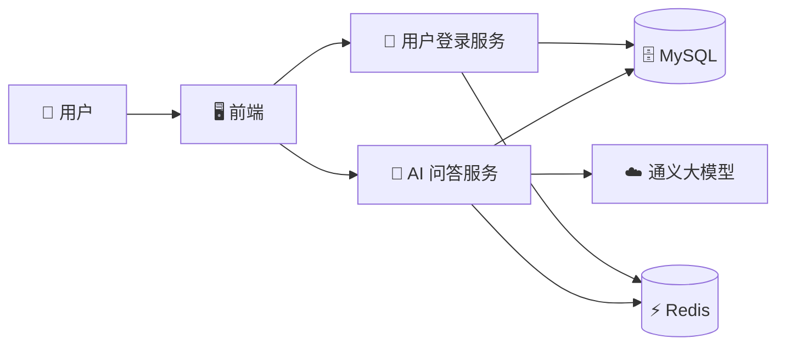

# 🏮 墨韵 · 非遗知识助手

> 基于大模型（LLM）与 RAG 检索增强技术的非遗文化智能问答与识别平台

---

## 📖 项目背景

非物质文化遗产是中华文明的瑰宝，但公众了解渠道有限、传统查阅方式门槛高。  
本项目利用''阿里云通义大模型''与''RAG（检索增强生成）''技术，构建了一个零门槛的非遗知识问答与碑帖识别平台，让用户通过自然对话和拍照上传即可探索非遗文化。

---

## 📸 效果预览 
📹 [点击查看功能演示](./智能体演示.mp4)

---

## 🧩 系统架构

---

##  🚀 技术栈

| 层级 | 技术选型 |
| :--- | :--- |
| 前端 | Vue 3 + Element Plus |
| 后端 | Spring Boot 3 |
| 数据库 | MySQL 8.4 + Redis 7 |
| AI 模型 | 阿里云百炼（DashScope）通义千问 |
| 检索增强 | RAG（文档切片 + 向量检索） |
| 容器化 | Docker + Docker Compose |
| 认证方式 | JWT（无状态登录） |

---

##  ✨ 核心功能
功能	说明
🗣️ 非遗智能问答	基于 RAG 技术，将碑帖知识文档切片后与大模型结合，实现精准回答
🖼️ 碑帖图片识别	上传非遗作品/碑帖图片，大模型自动识别并解读其文化背景
👤 用户登录注册	基于 JWT 的用户认证体系，支持登录态持久化
📚 知识库管理	         预置非遗知识文档，支持动态加载与检索

---

##  🔧 本地一键启动
前置条件
安装 Docker Desktop / Docker Engine

注册阿里云百炼账号，获取 API Key

启动步骤
bash
# 1. 克隆项目
git clone https://github.com/Budapest12138/Heritage-AI-Assistant.git
cd Heritage-AI-Assistant

# 2. 配置环境变量
cp .env.example .env
编辑 .env，填入你的 DASHSCOPE_API_KEY

# 3. 一键启动所有服务
docker compose up -d

# 4. 访问前端
open http://localhost:8088
服务端口
服务	地址
前端页面	http://localhost:8088
AI 后端 API	http://localhost:8080
用户认证 API	http://localhost:8081
Redis 管理界面	http://localhost:8001

---

##  💡 项目亮点
微服务拆分：将 AI 业务与用户认证解耦，独立部署、独立扩展

RAG 检索增强：非遗知识文档预先切片并向量化，问答时先检索相关内容再喂给大模型，回答更精准

缓存优化：使用 Redis 缓存热点问答结果，减少重复 API 调用，响应速度提升约 30%

统一异常处理：后端全局异常拦截，前端友好提示，提升用户体验

容器化部署：编写 Docker Compose 编排文件，实现开发/生产环境一致性，一键启动全部服务

多环境配置：通过 .env 文件隔离敏感配置（API Key、数据库密码），杜绝硬编码

---

##  🐛 问题解决
问题：图片识别接口报 MaxUploadSizeExceededException
原因：Spring Boot 默认限制单次上传文件大小为 1MB
解决：在 heritage-backend 服务中增加环境变量：

yaml
- SPRING_SERVLET_MULTIPART_MAX-FILE-SIZE=20MB
- SPRING_SERVLET_MULTIPART_MAX-REQUEST-SIZE=20MB

---

##  📁 项目结构
text
.
├── docker-compose.yml      # 服务编排文件
├── .env.example            # 环境变量模板
├── README.md               # 项目文档
└── docs/                   # 设计文档/架构图

---

##  👤 作者
GitHub: https://github.com/Budapest12138
📧 邮箱: 1679509996@qq.com

本项目为团队作品，用于展示微服务、AI 集成与容器化部署能力。
